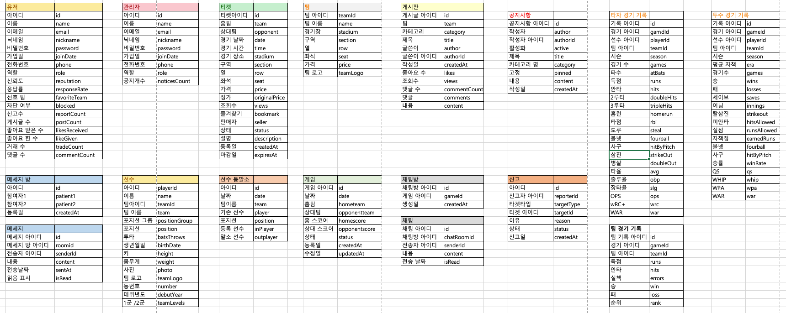
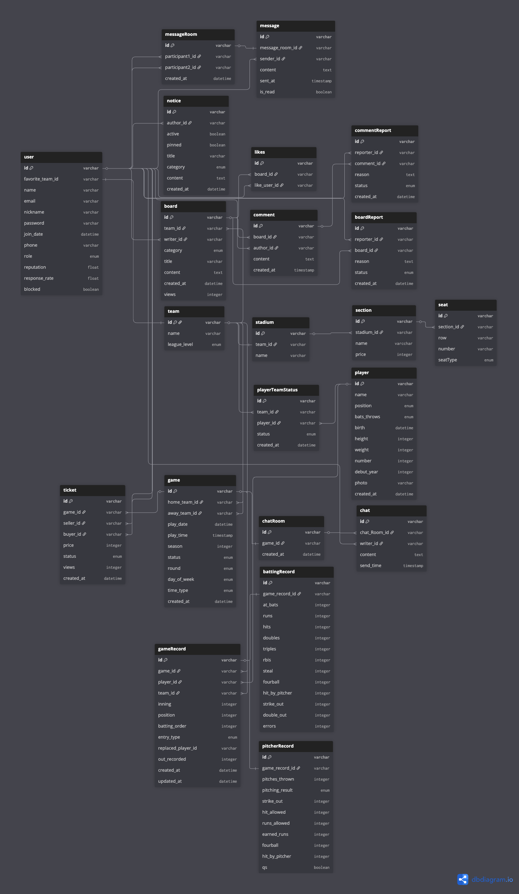

# FANBALL 프로젝트

---

# 주제: KBO 기반 야구 팬 커뮤니티 & 티켓 양도 플랫폼

---

## 개발 형태

---

BackEnd

-> BackEnd: Java, Spring, Jpa, Mysql

---

## 목표
- KBO 정보를 제공, 팬간 커뮤니티, 채팅창, 메세징을 통해 팬들의 커뮤니티 서버를 구축한다.

## 필요한 데이터

---

## ERD 작성

---

## 테이블 설명

1. User(계정)
    - 회원 정보 관리 테이블
    - 아이디를 기본키로 사용
    - 팀 아이디를 팀 테이블에서 FK로 연결 -> 선호 팀
    - 이름, 닉네임, 비밀번호, 이메일, 가입일, 전화번호, 역할(user, admin), 시뢰도, 응답률, 차단 여부 포함

2. Notice(공지시항)
    - 관리자의 공지사항 관리 테이블
    - 공지사항 아이디를 기본키로 사용
    - 작성자 아이디를 계정 테이블에서 FK로 연결
    - 제목, 활성화, 고정, 카테고리, 내용, 작성일 포함

3. Team(팀)
    - 각 팀 관리 테이블
    - 팀 아이디를 기본키로 사용
    - 경기장 -> 경기장 테이블, 이름, 리그(1군/2군) 포함

4. Stadium(경기장)
    - 경기장 관리 테이블
    - 경기장 아이디를 기본키로 사용
    - 팀 아이디 -> 팀테이블, 이름 포함

5. Section(구역)
    - 각 경기장 구역 관리 테이블
    - 구역 아이디를 기본키로 사용
    - 경기장 아이디 -> 경기장 테이블, 이름, 가격 포함

6. Seat(좌석)
    - 각 경기장 구역의 좌석 관리 테이블
    - 좌석 아이디를 기본키로 사용
    - 열, 번호, 좌석 타입을 포함함

7. MessageRoom(메세지 방)
    - 1:1 DirectMessage 방 관리 테이블
    - 메세지 방 아이디를 기본키로 사용
    - 참가자 1, 참가자 2를 계정 테이블 연결, 생성일 포함

8. Message(메세지)
    - 메세지 관리 테이블
    - 메세지 아이디를 기본키로 사용
    - 메세지 방 아이디를 메세지 방 테이블 연결, 내용, 전송시간, 읽음 표시 포함

9. Board(게시판)
    - 팀별 게시판 관리 테이블
    - 게시판 아이디를 기본키로 사용
    - 팀 아이디는 팀 테이블, 작성자 아이디는 계정 테이블 연결
    - 카테고리는 (자유게시판, 선수, 경기후기), 제목, 내용, 조회수, 생성일 포함

10. Likes(좋아요)
    - 각 게시글의 좋아요 수 관리 테이블
    - 좋아요 아이디를 기본키로 사용
    - 게시글 아이디를 게시판 테이블 연결, 좋아요 누른 계정은 계정 테이블로 연결

11. Comment(댓글)
    - 각 게시글의 댓글 테이블
    - 댓글 아이디를 기본키로 사용
    - 게시글 아이디는 게시판 테이블 연결, 작성자는 계정 테이블로 연결
    - 내용, 생성일 포함

12. BoardReport(게시글 신고)
    - 게시글 신고 테이블
    - 게시글 신고 아이디를 기본키로 사용
    - 신고자 아이디는 계정 테이블 연결, 게시글 아이디는 게시글 테이블 연결
    - 이유, 상태(수용, 무시, 대기중), 신고일 포함

12. CommentReport(댓글 신고)
    - 댓글 신고 테이블
    - 댓글 신고 아이디를 기본키로 사용
    - 신고자 아이디는 계정 테이블 연결, 댓글 아이디는 댓글 테이블 연결
    - 이유, 상태(수용, 무시, 대기중), 신고일 포함

13. Player(선수)
    - 선수 정보 테이블
    - 선수 아이디를 기본키로 사용
    - 선수 이름, 포지션, 투타 유형, 생년월일, 키, 몸무게, 등번호, 데뷔년도, 사진, 생성일 포함

14. PlayerTeamStatus(등말소 기록)
    - 선수 등/말소 기록 테이블
    - 등/말소 기록 아이디를 기본키로 사용
    - 팀 아이디는 팀 테이블 연결, 선수 아이디는 선수 테이블 연결
    - 상태(1군 등록, 1군 말소, 2군 등록, 2군 말소, null), 생성일 포함

15. Game(게임)
    - 게임 테이블
    - 게임 아이디를 기본키로 사용
    - 홈팀 아이디, 어웨이팀 아이디는 팀 테이블 연결
    - 경기 날짜, 경기 시간, 시즌, 생성일 포함
    - 상태(예정, 게임중, 경기취소, 경기종료), 전/후반기(전반기, 후반기), 요일(월, 화, 수, 목,금,토, 일), 낮밤(낮, 밤) 포함

16. Ticket(티켓)
    - 티켓 테이블
    - 티켓 아이디를 기본키로 사용
    - 게임 아이디는 게임 테이블 연결, 구매자, 판매자 계정 테이블 연결, 가격, 상태(판매중, 판매완료), 조회수, 게시일자 포함

17. ChatRoom(채팅방)
    - 채팅방 테이블
    - 채팅방 아이디를 기본키로 사용
    - 게임 아이디를 게임 테이블 연결, 생성일 포함

18. Chat(채팅)
    - 채팅 테이블
    - 채팅 아이디를 기본키로 사용
    - 채팅방 아이디를 채팅방 테이블 연결, 전송자 계정 테이블 연결, 내용, 전송 시간 포함

19. GameRecord(경기 기록)
    - 경기 기록 테이블
    - 경기 기록 아이디를 기본키로 사용
    - 게임 아이디는 게임 테이블 연결, 선수 아이디는 선수 테이블 연결, 팀 아이디는 팀 테이블 연결
    - 이닝, 포지션(포지션 번호), 타순, 엔트리타입(대타, 대주자, 대수비, 투수 교체, null)
    - 교체된 선수, 아웃 카운트, 생성일, 업데이트일 포함

20. BattingRecord(타자 기록)
    - 타자 기록 테이블
    - 타자 기록 아이디를 기본키로 사용
    - 게임 기록은 게임 기록 테이블 연결
    - 타석수, 득점수, 안타, 2루타, 3루타, 타점, 도루, 볼넷, 사구, 삼진, 병살, 실책 포함

21. PitcherRecord(투수 기록)
    - 투수 기록 테이블
    - 투수 기록 아이디를 기본키로 사용
    - 게임 기록은 게임 기록 테이블 연결
    - 투구수, 투수 결과(승/패, 세이브, 홀드, null), 탈삼진, 피안타, 실점, 자책점, 볼넷, 사구, 퀄리티 스타트 포함

---

## 관련 내용

- 크롤링은 법적 문제가 발생 할 수 있으므로 샘플 데이터를 넣어 사용했습니다.

---

## 주요기능

## 회원 서버

### 공통
- [x] 이메일을 통한 인증번호로 회원가입

### 사용자
- [x] 회원가입
- [x] 인증(이메일)
- [x] 로그인 토큰 발행
- [x] 로그인 토큰을 통한 제어 확인(JWT, Filter를 사용해서 간략하게)
- [ ] 사용자 정보(CRUD)
- [x] 이메일 찾기, 비밀번호 찾기로 변경
- [x] 닉네임, 이메일 중복 체크
- [ ] 즐겨찾는 팀 설정
- [ ] 평판, 응답률 관리
- [ ] 탈퇴 처리

### 관리자
- [ ] 회원 차단, 신고 관리
- [ ] 게시글/ 댓글 삭제 처리
- [ ] 공지사항 발행 / 업데이트

## KBO 서버
### 팀/ 선수/ 구장
- [ ] 팀 순위 조회
- [ ] 선수 정보 (CRUD)
- [ ] 1군/2군 등록 이력 관리(CRUD)
- [ ] 구장 및 섹션, 좌석 정보 관리(CRUD)

### 경기 정보
- [ ] 경기 일정 (CRUD)
- [ ] 팀별 경기 일정 조회
- [ ] 시즌 / 라운드 / 전.후반기 / 요일 / 주간.야간 별 필터 조회
- [ ] 경기 상태 업데이트

### 경기 기록
- [ ] 경기별 선수 출전 기록 조회
- [ ] 타자별 상세 기록 조회
- [ ] 투수별 상세 기록 조회
- [ ] 통합 선수별, 상황별 기록 조회
- [ ] 경기 결과 저장

## 커뮤니티
### 게시판
- [ ] 게시글 (CRUD)
- [ ] 게시판 카테고리별 조회
- [ ] 댓글 CRUD
- [ ] 좋아요, 취소 처리
- [ ] 신고 접수, 상테 업데이트

### 메시지
- [ ] 1:1 메시지방 생성 및 목록 조회
- [ ] 메시지 전송 / 수신/ 읽음 처리

### 채팅
- [ ] 경기별 실시간 채팅방 생성 및 목록 조회
- [ ] 채팅 메시지 저장, 조회

### 티켓
- [ ] 티켓 등록(판매자, 구매자 정보 포함)
- [ ] 티켓 조회, 상세보기
- [ ] 티켓 거래 상태 관리
- [ ] 조회수 집계
